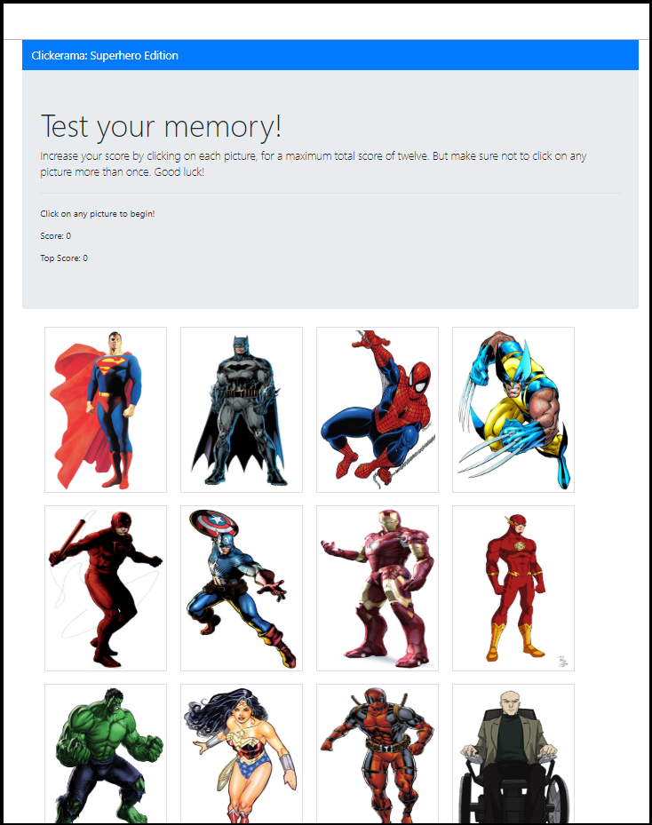
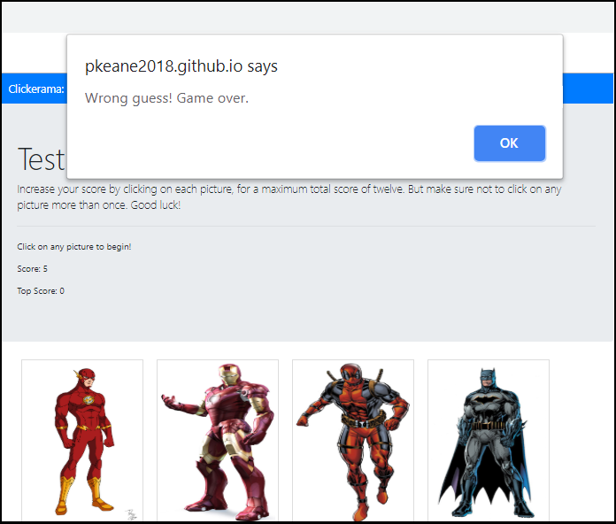
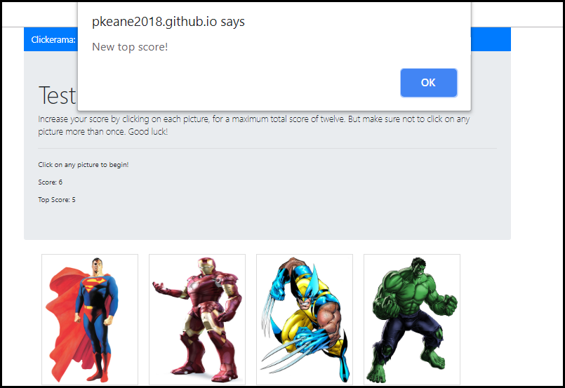
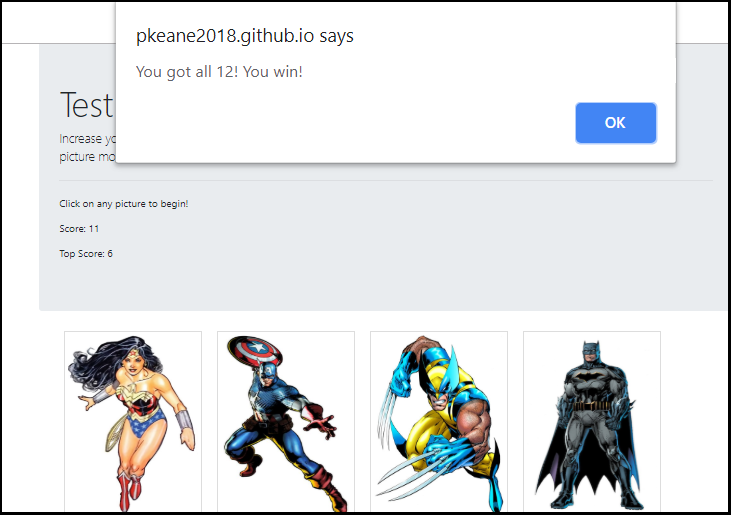

This project was bootstrapped with [Create React App](https://github.com/facebook/create-react-app).

# Clickerama

This game is a memory test in which users are shown a series of images of superheroes and must attempt to click on each one, without clicking on any more than once. This site is geared toward anyone who enjoys memory games and any games that challenge one's mind.

## How to run the site on a local machine
The repository can be cloned by clicking the Clone or Download button on the main repository page, then clicking the button next to the url which appears below. Then open a Terminal or Git Bash window, navigate to the location where you want to place the cloned repository, then type 'git clone' and then paste the repository that was just copied. Navigate to the 'master' branch by typing 'git checkout master' in the terminal. The neccessary node packages can installed by navigating into the main directory in the terminal and entering 'npm install.' Then enter 'npm start' to launch the site. The site should then open in the default web browser at 'localhost:3000.'

## Repository Organization
On the master branch, the code is mainly located within the 'public' and 'src' folders. Located within the 'public' folder is 'index.html', which contains the div with an id of 'root', which is where the react components are rendered when the application starts. The 'src' folder most of the rest of the code for the site, including 'App.js', which imports and returns the Game component, which can be found within the 'components' folder.'index.js' imports 'App.js' and uses react-dom to render the App component, and all components it contains, in the 'root' div in 'index.html.' Also in the 'src' folder is 'characters.json', which contains information on each of the superheroes whose images are shown on the page, including the character's name, an id number, and the url of the image of the superhero that will be displayed on the page.
One subfolder in the 'src' folder is 'components.' The 'components' folder in turn contains three subfolders for each of the react components that will be rendered on the site - 'Game', 'Navbar', and 'PicBlock.' Each of these folders contains an 'index.js' file, which contains the code for the JSX elements that will be displayed on the page, methods that contain the logic of the site, and state information for the components. Each folder also contains a 'style.css' file which contains code to determine how the components are styled. The Navbar component displays the navbar at the top of the page. The 'PicBlock' has code for displaying the images of each superhero. 'Game.js' imports the 'Navbar' and determines how this component will be rendered on the screen. It also imports the 'PicBlock' component and well as 'characters.json' file, and maps through each of the characters in the array within the characters.json file to display the image of each character on screen. This component also contains methods which control the logic of the game, including shuffling the order of characters each time a superhero image is clicked, updating the user's score and the top score, and alerting the user when he or she wins or loses or achieves a new top score.

## How to use the site
The goal of the game is to click on the image of each character, without clicking on any more than once. However, every time an image is clicked, the order of the characters on the page is shuffled. The user must remember which one he or she has already clicked. Each time the user clicks on the image of a new character, his or her score increases by one. If the user clicks on a character twice, a message appears on screen stating that he or she has lost and the score is reset to zero. If the score up until that point is higher than the user's previous top score, an alert is displayed informing the user that this score is the new top score. If the user successfully clicks on all 12 characters, an alert is displaying telling the user that he or she has won and the game is over.
  

  

  

  

## Technology used

* HTML
* CSS
* CSS Bootstrap
* React
* JSX
* Nodejs
* Node packages:
    * react
    * react-dom
    * express

## Link to deployed site
<a href="https://pkeane2018.github.io/Clickerama-2.0/">Clickerama</a>

